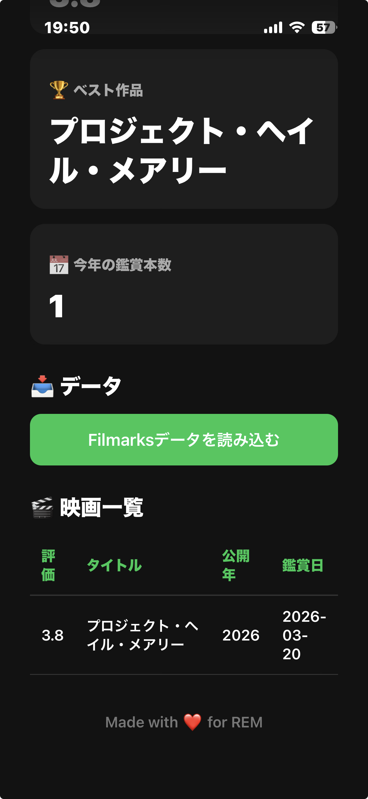

# Filmarks Dashboard



Filmarks の鑑賞記録をもとに、自分専用の映画ダッシュボードを表示する Web アプリケーションです。

GitHub Pages 上で動作する静的サイトとして開発しています。

---

## 主な機能

- 映画一覧表示
- 総鑑賞本数
- 平均評価
- ベスト作品
- 今年の鑑賞本数

---

## 今後追加予定

- タイトル検索
- 並び替え
- ベスト10ランキング
- グラフ表示
- CSV / JSON インポート
- Filmarks データ自動更新

---

## ディレクトリ構成

```
filmarks-dashboard/
│
├── index.html
├── README.md
│
├── css/
│   └── style.css
│
├── js/
│   ├── app.js
│   ├── dashboard.js
│   ├── movieService.js
│   └── movieTable.js
│
└── data/
    └── movies.json
```

---

## JavaScript構成

| ファイル | 役割 |
|----------|------|
| app.js | アプリケーション起動 |
| movieService.js | データ取得 |
| dashboard.js | ダッシュボード更新 |
| movieTable.js | 映画一覧表示 |

---

## 開発ルール

- 役割ごとに JavaScript ファイルを分割する
- 1つの関数は1つの責務だけ持つ
- `const` を優先して使用する
- `camelCase` で命名する
- JSDoc コメントを付ける
- Commit は機能単位で行う

---

## 開発環境

- GitHub
- GitHub Pages
- Working Copy（iOS）
- ChatGPT

---

## ライセンス

Personal Project
